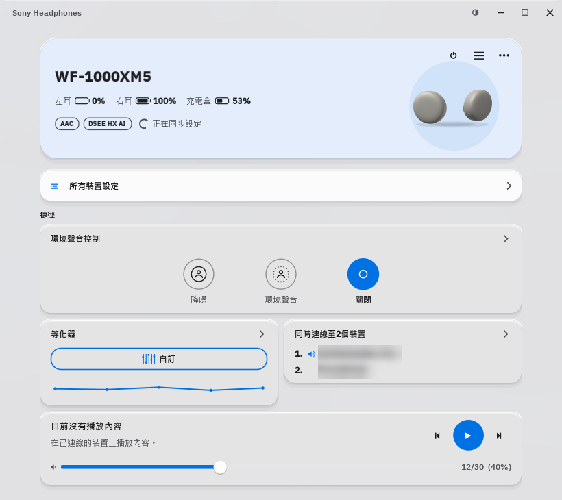
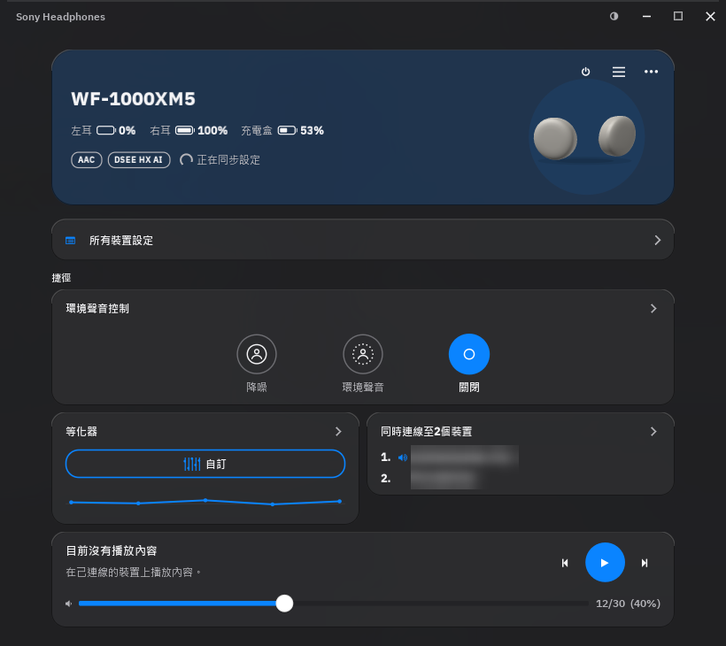
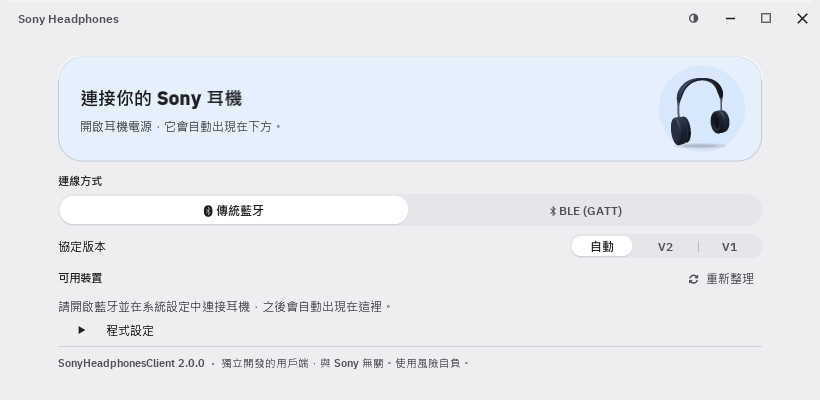
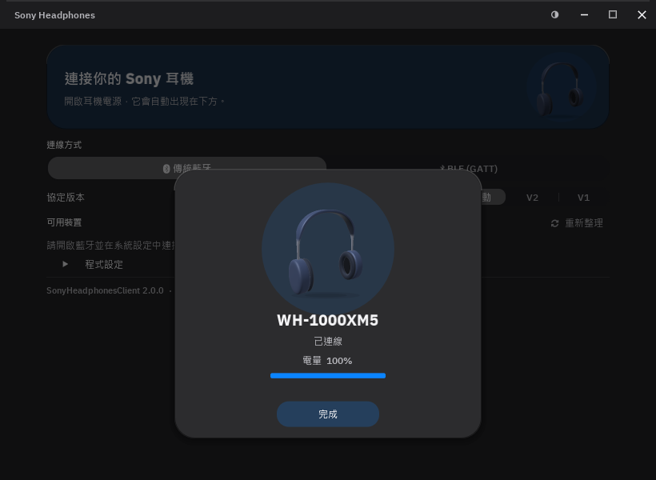
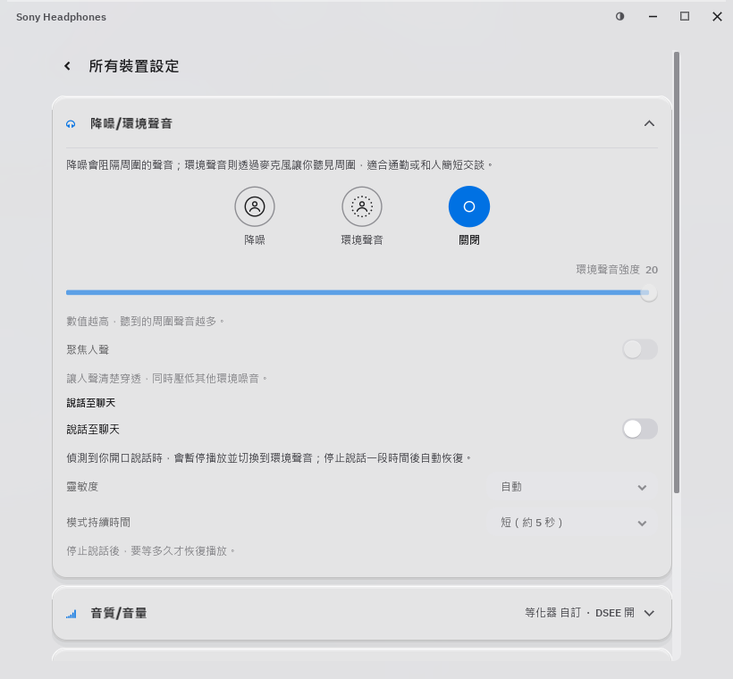
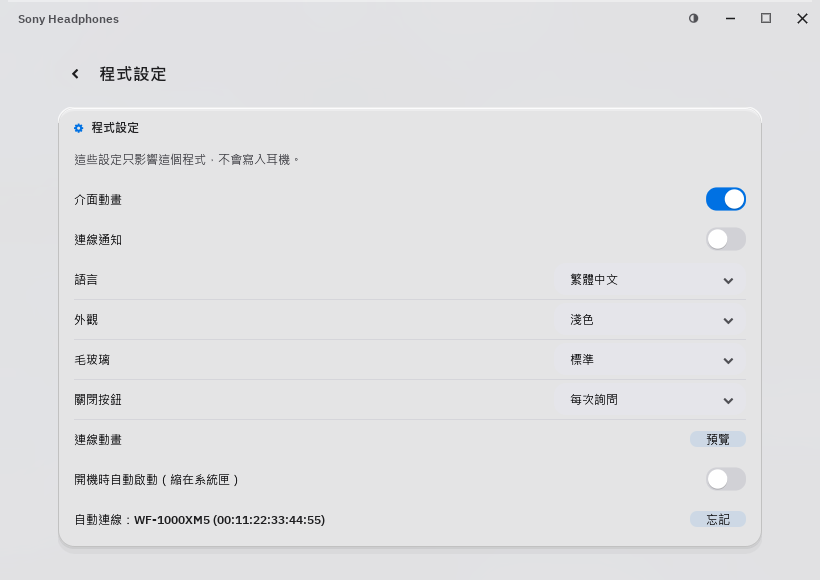

<p align="center">
  
</p>

<h1 align="center">SonyHeadphonesClient</h1>

<p align="center">
  在電腦上控制 Sony 耳機：降噪、等化器、多點連線、電量，一個視窗全部搞定。<br>
  非官方程式，與 Sony 無關。
</p>

<p align="center">
  <a href="https://github.com/yeeN1234/SonyHeadphonesClient/releases/latest"></a>
  <a href="https://github.com/yeeN1234/SonyHeadphonesClient/actions/workflows/cmake.yml"></a>
  <a href="LICENSE"></a>
</p>

<p align="center">
  
  
</p>

## 簡介

SonyHeadphonesClient 是 Sony 耳機的桌面控制程式。它透過藍牙直接和耳機溝通，使用的是 Sony 官方 App（Sound Connect，舊名 Headphones Connect）同一套協定，平常要拿出手機才能調的設定，在電腦上就能完成。

這個版本是 [mos9527/SonyHeadphonesClient](https://github.com/mos9527/SonyHeadphonesClient) 的分支，在上游之外加上：

- **重新設計的介面**：iOS 風格的毛玻璃與卡片、淺色／深色模式、更緊湊的排版
- **三種語言**：繁體中文、日本語、English
- **3D 耳機模型與連線動畫**：連上耳機時跳出類似 AirPods 的卡片，模型可以用滑鼠拖曳旋轉
- **首頁捷徑**：降噪模式、等化器、多點連線、播放控制，打開就能調
- **系統整合**：音量與 Windows 系統音量同步、系統匣顯示電量並可切換降噪、連線通知、開機自動啟動
- **穩定連線**：自動重新連線，耳機沒有回應時會自動重設藍牙；同一時間只會執行一個程式，避免搶耳機連線

## 功能

實際能調整的項目依耳機型號而定，程式只會顯示耳機支援的功能。

| 分類 | 項目 |
|---|---|
| 降噪/環境聲音 | 降噪／環境聲音／關閉、環境聲音強度、聚焦人聲、自動環境聲音、說話至聊天（靈敏度、模式持續時間） |
| 音質/音量 | 等化器（預設組合與自訂頻段）、清晰低音、DSEE、聆聽模式（背景音樂、電影）、通話時擷取自己的聲音 |
| 連線 | 同時連線至 2 個裝置、已配對裝置管理（切換播放裝置、進入配對模式、取消配對）、Bluetooth 連線品質 |
| 控制 | 觸控感應器控制面板、[NC/AMB] 按鈕操作設定、左右耳觸控或按鍵的功能、取下耳機時暫停、頭部手勢 |
| 電源/電池 | 左右耳與充電盒電量、自動關閉電源、取下耳機時關閉、關閉耳機電源 |
| 系統 | 通知與語音導覽（含音量）、裝置資訊、支援的功能清單 |
| 播放 | 曲目資訊、上一首／播放／下一首、音量 |

## 下載與安裝

1. 到 [Releases](https://github.com/yeeN1234/SonyHeadphonesClient/releases/latest) 下載 `SonyHeadphonesClient-win-x64-版本.zip`  
   （Snapdragon 等 ARM 處理器的筆電請下載 `win-arm64`）
2. 解壓縮到任意資料夾，例如 `文件\SonyHeadphonesClient`
3. 執行 `SonyHeadphonesClient.exe`。不需要安裝，也不需要另外安裝執行環境

> **第一次執行時看到「Windows 已保護您的電腦」？**  
> 這是因為程式沒有數位簽章。點「其他資訊」→「仍要執行」即可。

**系統需求**：Windows 10 或 11、有藍牙的電腦，以及支援 Sony Sound Connect App 的耳機（見[支援的耳機](#支援的耳機)）。macOS 與 Linux 版也會一起發布在 Releases，但這個分支主要在 Windows 上測試。

**解除安裝**：先在「程式設定」關閉「開機時自動啟動」，結束程式後刪除資料夾即可。設定存在 `%APPDATA%\SonyHeadphonesClient`，要一併清除就刪掉這個資料夾。

## 使用方式

### 第一次連線

1. 在 Windows「設定 → 藍牙與裝置」配對耳機，跟平常連藍牙耳機一樣
2. 開啟程式，耳機會出現在「可用裝置」清單
3. 點一下耳機，連上後會跳出連線動畫，接著進入首頁

之後每次開啟程式、或耳機重新開機，都會自動連上上次使用的耳機；連線中斷時也會自動重試。

### 日常操作

- **切換降噪**：首頁的「環境聲音控制」，或在系統匣圖示按右鍵
- **調整音效**：首頁的「等化器」可以直接換預設組合，細部設定在「所有裝置設定 → 音質/音量」
- **完整設定**：首頁的「所有裝置設定」
- **關閉視窗**：預設每次詢問。選「縮到系統匣」程式會在背景保持連線，選「結束程式」則會中斷連線。勾選「記住我的選擇」就不再詢問，之後可以在「程式設定 → 關閉按鈕」更改
- **開機就連上耳機**：在「程式設定」開啟「開機時自動啟動（縮在系統匣）」

## 介面導覽

### 連線畫面



還沒連上耳機時的畫面。

- **上方卡片**：上次使用的耳機；連線中會出現藍色轉圈
- **連線方式**：大多數耳機用「傳統藍牙」；LE Audio 連線才選「BLE (GATT)」
- **協定版本**：保持「自動」即可（先試 V2，連不上再改用 V1）。V2 是 WH/WF-1000XM5 之後的機型，V1 是較舊的機型
- **可用裝置**：已在 Windows 配對的耳機，點一下連線；右上角「重新整理」重新尋找
- **程式設定**：展開後可以調整語言、外觀等，內容和下方的[程式設定](#程式設定)相同

### 連線動畫



連上耳機時跳出的卡片：耳機轉一圈後停在產品角度，顯示名稱、狀態和電量，約 5 秒後自動關閉，也可以按「完成」或點卡片外面關閉。想再看一次，到「程式設定 → 連線動畫」按「預覽」。

### 首頁

<p>
  
  
</p>

連上耳機後的主畫面（左：淺色模式，右：深色模式）。

- **裝置卡片**：型號、左右耳與充電盒電量、目前的音訊編碼（AAC、LDAC 等）與 DSEE 狀態。右邊的 3D 模型可以用滑鼠左右拖曳旋轉，放開後會轉回原位
- **右上角按鈕**：⏻ 關閉耳機電源（會先確認）、☰ 程式設定、⋯ 更多（中斷連線）
- **所有裝置設定**：進入完整設定頁
- **捷徑**
  - 環境聲音控制：降噪／環境聲音／關閉，一鍵切換
  - 等化器：點按鈕換預設組合，下方曲線是目前的設定
  - 同時連線至 2 個裝置：耳機目前連著哪些裝置，喇叭圖示代表正在播放的那一台
- **播放卡片**：正在播放的曲目、上一首／播放／下一首；音量與 Windows 系統音量同步，也可以用滑鼠滾輪調整
- 往下捲動時，頂端會出現精簡的裝置列，按鈕一樣可以用

### 所有裝置設定



耳機的完整設定，分成六個區塊：降噪/環境聲音、音質/音量、連線、控制、電源/電池、系統。區塊收起時，標題右邊會顯示目前設定的摘要，點標題展開；每個選項下方都有說明。按左上角的返回鍵、`Esc` 或滑鼠側鍵「上一頁」回到首頁。

### 程式設定



只影響這個程式，不會寫入耳機。從首頁右上角的 ☰ 進入，或在連線畫面展開「程式設定」。

| 項目 | 說明 |
|---|---|
| 介面動畫 | 關閉後介面不再有動畫效果 |
| 連線通知 | 連上、中斷、電量偏低時跳出 Windows 通知 |
| 語言 | 跟隨系統、English、繁體中文、日本語 |
| 外觀 | 跟隨系統、淺色、深色。視窗右上角的 ◐ 按鈕也能快速切換 |
| 毛玻璃 | 視窗背景的透明程度：關閉、標準、通透 |
| 關閉按鈕 | 按視窗的 ✕ 時：每次詢問、縮到系統匣、結束程式 |
| 連線動畫 | 按「預覽」重看連線動畫 |
| 開機時自動啟動 | 登入 Windows 後在系統匣啟動，並自動連上耳機 |
| 自動連線 | 會自動連線的耳機；按「忘記」後就不再自動連線 |

### 系統匣

程式在背景執行時，工作列右下角的耳機圖示會顯示電量：圖示填滿的程度代表剩餘電量，灰色是沒有連線、紅色是電量偏低、綠色是充電中。

- **滑鼠移上去**：顯示耳機名稱與電量
- **左鍵**：打開視窗
- **右鍵**：切換降噪／環境聲音／關閉、打開視窗或結束程式

## 支援的耳機

支援使用 Sony Sound Connect（舊名 Headphones Connect）App 的耳機。已有測試紀錄的機型如下，點進去可以看各項功能的支援狀況：

| 頭戴式 | 入耳式 |
|---|---|
| [WH-1000XM6](docs/device-support/WH-1000XM6.md) | [WF-1000XM6](docs/device-support/WF-1000XM6.md) |
| [WH-1000XM5](docs/device-support/WH-1000XM5.md) | [WF-1000XM5](docs/device-support/WF-1000XM5.md) |
| [WH-CH720N](docs/device-support/WH-CH720N.md) | [WF-C510](docs/device-support/WF-C510.md) |
| | [WF-L910](docs/device-support/WF-L910.md) |
| | [WF-LS900N](docs/device-support/WF-LS900N.md) |

較舊的 V1 協定機型（例如 WH-1000XM4、WH-1000XM3）的支援仍在開發中，部分功能可能無法使用。其他機型的支援狀況歡迎到上游的 [Issues](https://github.com/mos9527/SonyHeadphonesClient/issues) 回報。

## 常見問題

**清單裡找不到我的耳機**
先確認耳機已在 Windows 藍牙設定中配對並連線，再按「重新整理」。

**耳機在清單上，卻一直連不上**
程式會自動重試。耳機一直沒有回應時，程式會先自動重設一次藍牙，也會顯示「重設藍牙」按鈕讓你手動再試；重設時所有藍牙裝置會斷開幾秒，之後自動連回。

**有些設定沒有出現**
程式只顯示耳機回報支援的功能，不同型號能調整的項目不同。

**被 SmartScreen 或防毒軟體擋住**
程式沒有數位簽章，第一次執行時可能被攔下，按「其他資訊」→「仍要執行」即可。原始碼都在這個 repo，也可以[自己編譯](#自己編譯windows)。

**想恢復預設設定**
結束程式後刪除 `%APPDATA%\SonyHeadphonesClient\settings.ini`。

## 開發者

### 自己編譯（Windows）

需要 Visual Studio 2022（安裝「使用 C++ 的桌面開發」）與 CMake 3.31 以上。第三方函式庫由 CMake 自動下載並靜態連結。

```powershell
cmake -S . -B build -G "Visual Studio 17 2022" -A x64 -DMDR_ENABLE_CODEGEN=OFF
cmake --build build --config Release --target SonyHeadphonesClient
```

執行檔在 `build\client\Release\SonyHeadphonesClient.exe`。`-DMDR_ENABLE_CODEGEN=OFF` 直接使用 repo 裡已產生好的程式碼，不需要安裝 LLVM；修改 `libmdr` 的協定標頭時才需要開啟（見 [tooling](tooling/README.md)）。

### Linux、macOS 與網頁版

- **Linux** 需要 DBus 與 BlueZ 開發套件：
  - Debian／Ubuntu：`sudo apt install libbluetooth-dev libdbus-1-dev`
  - Fedora：`sudo dnf install bluez-libs-devel dbus-devel`
  - Arch Linux：`sudo pacman -S bluez dbus`

  看不到曲目資訊時，可能是 [MPRIS](https://wiki.archlinux.org/title/MPRIS) 沒有設定好，可以在背景執行 `mpris-proxy`（`bluez-tools`／`bluez-utils` 套件）。
- **macOS**：直接用 CMake 編譯即可。
- **網頁版（Emscripten）**：以 `emcmake cmake` 設定後編譯，再用任意靜態網頁伺服器提供 `build/client/`。需要支援 [Web Serial](https://caniuse.com/wf-serial) 的瀏覽器。上游有[線上版本](https://mos9527.com/SonyHeadphonesClient/)（不含本分支的修改）。

### 不接耳機也能測試介面

用錄好的耳機封包重播整個連線流程，會出現一副示範耳機（WF-1000XM5），點一下就能連線：

```powershell
SonyHeadphonesClient.exe --demo tests/WF-1000XM5-6.1.0
```

其他參數：`--minimized` 啟動時直接縮在系統匣。

### 3D 模型

首頁與連線動畫的 3D 模型預設由程式即時產生。若要顯示特定型號的模型，用 [tooling/ConvertModel.py](tooling/ConvertModel.py) 把 COLLADA（`.dae`）檔轉成 `client/Models/<型號>.mesh`（例如 `WH-1000XM5.mesh`），重新編譯後會複製到執行檔旁邊的 `Models` 資料夾；檔名出現在耳機型號裡時就會使用。請只使用你有權散布的模型。

### 發布新版本

推送 `v` 開頭的標籤就會自動發布：

```bash
git tag v2.1.0
git push origin v2.1.0
```

GitHub Actions（[`.github/workflows/cmake.yml`](.github/workflows/cmake.yml)）會編譯 Windows、macOS、Linux 版本並執行封包重播測試，全部通過後建立 Release，附上各平台的壓縮檔與自動產生的更新說明。

- 程式顯示的版本號取自標籤（`v2.1.0` → `2.1.0`）
- 標籤帶有 `-`（例如 `v2.1.0-beta.1`）會標記為預發布版本
- 平常推送程式碼也會自動編譯，可以在 Actions 頁面下載測試版

## 致謝與授權

- 上游專案：[mos9527/SonyHeadphonesClient](https://github.com/mos9527/SonyHeadphonesClient)，源自 [Plutoberth/SonyHeadphonesClient](https://github.com/Plutoberth/SonyHeadphonesClient)
- 以 [MIT 授權](LICENSE)釋出
- Sony 與各產品名稱為 Sony Group Corporation 的商標。本專案為獨立開發，與 Sony 無關，使用風險自負
